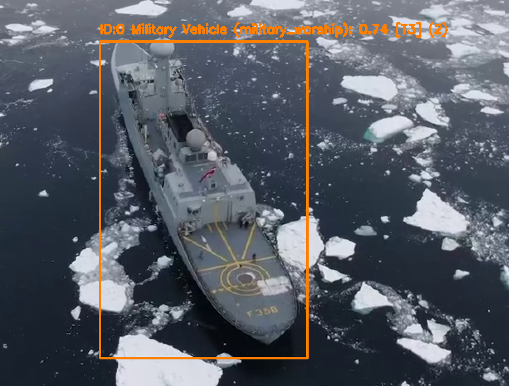
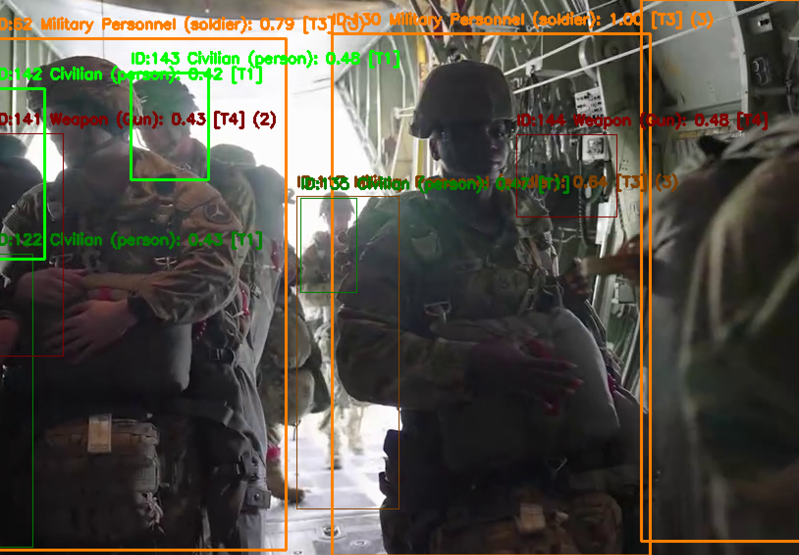

# dd-object-detection

Take-home assignment for Dominion Dynamics. I have chosen the following problem to complete:

Problem 1 — Scope: Object Detection and CV
Build a system that performs real-time object detection and categorization on a video stream (using CoCo or
other available taxonomies) using a bespoke or modified public model.
Required:
+ Draw bounding boxes around detected objects that modify an existing model or create a model from
scratch.
+ Show detection confidence values.
+ Situate an object within a taxonomy
Optional Extensions (for example):
+ Localization labels based on object categories or taxonomies.
+ Multiple model aggregation/synthesis to increase confidence or nuance detections
+ Localization persists when the object is partially or temporarily occluded.

## Project Overview

This project implements a real-time object detection system focused on military asset detection in arctic conditions. It combines multiple YOLO models to detect and classify military-relevant objects with localization and tracking in adverse conditions. Due to the nature of the assignment, I wanted to make it specific to Dominion Dynamics' potential use cases.

| Requirement | Status | Implementation |
|-------------|--------|----------------|
| Bounding boxes with modified model | ✅ | Custom YOLOv8 model trained on military dataset |
| Detection confidence values | ✅ | Display confidence score generated by YOLO model with bounding box |
| Taxonomy classification | ✅ | Developed a taxonomy system that classifies military assets into larger categories and threat levels |
| Localization labels | ✅ | Category labels from taxonomy with threat levels represented by colour |
| Multi-model aggregation | ✅ | 3-model fusion with priority weighting |
| Localization persistence through occlusion | ✅ | Object tracker maintains IDs during occlusion |

## Setup and Usage

```bash
# Clone repository
git clone <repo-url>
cd dd-object-detection

# Create virtual environment
python -m venv .venv
source .venv/bin/activate

# Install dependencies
pip install -r requirements.txt
```

Run with:
```bash
python src/main.py SOURCE --multi-model
```
where src is the path of an mp4 file OR 0 for the user's webcam. The --multi-model flag specifies model fusion.s

## Video Stream

The `VideoStream` class (`src/video_stream.py`) handles video input from webcam and .mp4 files. In practice, it could be extended to support a physical camera suite. It uses OpenCV for video and frame manipulation, which is the library I have the most experience using for this computer vision task.

## Model Selection and Training

### Initial Model

Used YOLOv8s as the base model, which was pre-trained on the COCO dataset. It was selected for it's speed and accuracy in real-time video processing, and was a great place to start.



### Custom Military Model

A custom model was trained on the Military Assets Dataset (see References) with 12 classes:
| Class ID | Label              |
| -------- | ------------------ |
| 0        | camouflage_soldier |
| 1        | weapon             |
| 2        | military_tank      |
| 3        | military_truck     |
| 4        | military_vehicle   |
| 5        | civilian           |
| 6        | soldier            |
| 7        | civilian_vehicle   |
| 8        | military_artillery |
| 9        | trench             |
| 10       | military_aircraft  |
| 11       | military_warship   |

It was further augmented by random snow and fog using the `albumentations` library to simulate arctic conditions.

As for the training of the model, the most-recent iteration of model training can be found in `model/train.py`. Image size and epochs had to be constrained for my laptop, which will be detailed further in the Future Development section. However, this model remained fast and lightweight as it used the YOLOv8s architecture, and was effective in classifying military assets.


### Third-Party Threat Detection Model

While the military model was effective, the test set was not as comprehensive as I would've liked, and it fell short on weapons detection specifically. Since I believe this is one of the most important features of such a model, I sourced a Threat Detection model on Hugging Face courtesy of Subhansh Malviya. This model will be used in model fusion, and classifies the following:

| Class ID | Label     |
| -------- | --------- |
| 1        | Gun       |
| 2        | Explosive |
| 3        | Grenade   |
| 4        | Knife     |

## Taxonomy

Detections are classified into threat-based categories. I searched for a military taxonomy standard but was unable to find consistent sources, so based it on trends in my findings. The specific taxonomies can be found in `src/taxonomy.py`, and here are the threat categories:

| Threat Level | Color          | Categories                                           |
| ------------ | -------------- | ---------------------------------------------------- |
| 4 (Critical) | 🔴 Red         | Weaopon, Artillery, Explosive                        |
| 3 (High)     | 🟠 Orange      | Military Personnel, Military Vehicle                 |
| 2 (Medium)   | 🟡 Yellow      | Fortification                                        |
| 1 (Low)      | 🟢 Green       | Civilian, Civilian Vehicle                           |
| 0 (None)     | ⚪ Gray        | Other                                                |

## Model Aggregation/Synthesis

The `MultiModelDetector` class in `src/detector.py` aggregates the results from multiple models. It is meant to be flexible with respect to the amount of models used, and has been built to prioritize military labels. It updates confidence based on all models in use, and merges bounding boxes based on the intersection of each bounding box.

## Localization Persistence

The `ObjectTracker` class in `src/detector.py` maintains the localization of an object across frames, keeping track of it even when moving quickly or temporarily blocked. It works by calculating the centroid of each detection and matching to existing objects based on the minimum distance. The object ID is maintained even when temproarily undetected for a user-specified number of frames. When an object is "occluded", the bounding box is dimmed until the object is picked up again or enough frames pass.


With model fusion and localization persistence combined, scenes with many assets can get cluttered easily. One of the best next steps given more time would be to systematically improve the performance of each model and determine the best weights and priorities.

## Major Decisions and Trade-Offs

### Languages and Tools

Opted for Python due to robust and available suite of machine learning tools that I am familiar with. Development speed outweights the slow runtime compared to C++.

YOLOv8 was used due to the mention of COCO in project description, as it is pretrained. Also provides a valuable base for training custom models

OpenCV was selected as the industry standard for video capture and frame manipulation, as well as familiarity.

### Model Size

Used YOLOv8s (small) instead of nano or medium versions. It balances accuracy and speed of inference. Depending on the hardware and compute constraints, different selections could be made in the field.

### Image Augmentation

The addition of snow/fog augmentations increases training time but allows the model to generalize better to the specific weather conditions.

### Localization Through Occlusion
Centroid-based localication vs Deep SORT - Attempted a Deep SORT implementation using the `deep-sort-realtime` library, but it was ultimately too slow on my device. Instead, I opted for a more customized object tracker that used centroid distances and frame tracking to pick up similar objects that are close to the last seen version.

## Future Development

- Alert system - how are the results of this video feed used? If for monitoring, alert users and track threats in an area.
- Thermal and IR imagery support would be valuable for military applications
- Export to ONNX for edge deployment
- Continue training and iterating on the model, including custom training the threat detection model and non-military model.

## References

- Military Assets Dataset: https://www.kaggle.com/datasets/rawsi18/military-assets-dataset-12-classes-yolo8-format
- Threat-Detection-YOLOv8n by Subhansh Malviya: https://huggingface.co/Subh775/Threat-Detection-YOLOv8n
- Defence Visual Information Distribution Service:
    - https://www.dvidshub.net/video/888449/arctic-security-patrolling-natos-high-north-international
    - https://www.dvidshub.net/video/984380/go-army-beat-charlotte 